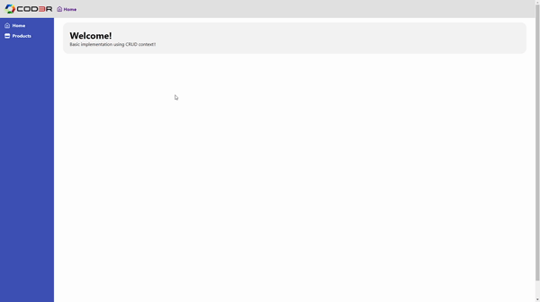
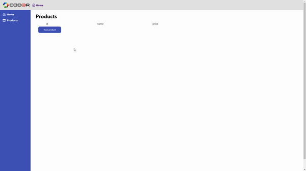
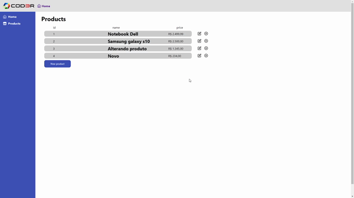

## Project developed inspired by the angular course from COD3R.

## Starting 🚀
### To run this project you will need!
- Clone this repo to your local machine
  ```
  git clone https://github.com/BrunoMSts/CRUD-NextJS.git
  ```
- Run npm or yarn
  ```javascript
  npm install || yarn install
  ```
- Run backend
  ```javascript
  npm start || yarn start
  ```
- Run frontend
  ```javascript
  npm dev || yarn dev
  ```

## Features ✨

<h2 align="center">Home</h2>
<p align="center"></p>


<h2 align="center">Products page</h2>
<p align="center"></p>


<h2 align="center">Updating</h2>
<p align="center"></p>


<h2 align="center">Deleting</h2>
<p align="center"></p>

---

### Techs ⚛
- [Typescript](https://www.typescriptlang.org/)
- [React / NextJS](https://nextjs.org/)
- [SCSS](https://sass-lang.com/)
